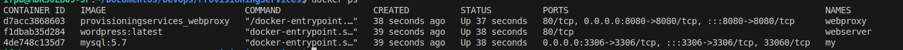
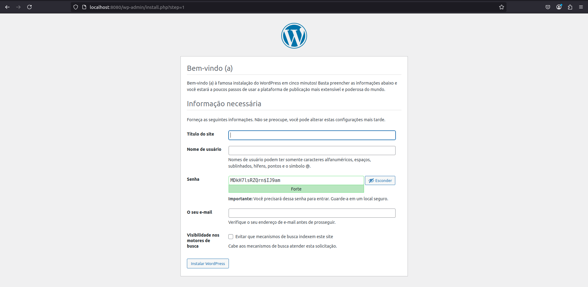

<h1 align="center"> Projeto de Administração de Sistemas Abertos II</h1>

- **Professor**: Pedro Filho
- **Instituição**: IFPB - Campus João Pessoa
- **Curso**: Redes de Computadores P4/6
- **Alunos**: Júlio Caio Rodrigues do Santos, Júlia Beatriz & Ryan de Morais Correia

<br>
<center></center>
<br>
<center></center>

## 📚 Visão Geral

O projeto configura uma arquitetura de balanceamento de carga utilizando as seguintes tecnologias:

## Tecnologias Usadas:

### NGINX

 

**NGINX** é um servidor web e proxy reverso que pode ser configurado para balanceamento de carga e servir conteúdo estático.

### Docker

 
 
**Docker** é uma plataforma para desenvolver, enviar e executar aplicações em containers, facilitando a configuração e o gerenciamento dos serviços.

### Wordpress

 

**Wordpress** é um CMS (Content Management System), que é usado para administrar sites, blogs, lojas virtuais, portais de notícia, áreas de membros e outros tipos de página.

### Vagrant (Adaptando ainda...)

 

**Vagrant** é uma ferramenta de código aberto que simplifica a criação e o gerenciamento de ambientes de desenvolvimento virtualizados. Ele suporta vários provedores de virtualização, como VirtualBox, VMware...

## 🚀 Começando

### Pré-requisitos

Certifique-se de ter os seguintes requisitos instalados:
- [Docker](https://docs.docker.com/get-docker/)
- [Docker Compose](https://docs.docker.com/compose/install/)

### Instalação e Execução

1. **Clone o repositório:**

    ```bash
    git clone https://github.com/Julio-Caio/DevOps/ProvisioningServices.git
    cd DevOps/ProvisioningServices
    ```

2. **Construa e inicie os containers:**

    ```bash
    docker-compose up --build
    ```

## 🌐 Colaboradores

[](https://www.linkedin.com/in/julio-caio-r-santos/)

[](https://www.linkedin.com/in/ryan-morais-correia-0abb94277)